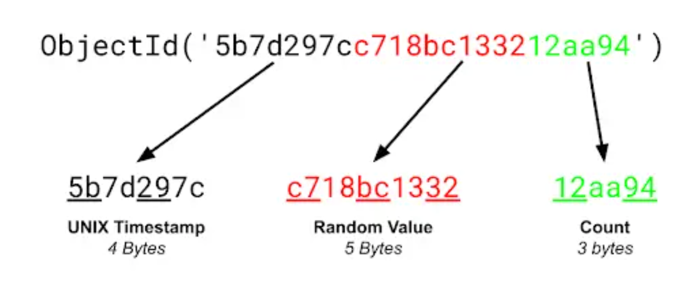

## Spring MongoDB

mongodb 는 NoSQL 의 한 종류로 `문서 지향 데이터베이스` 시스템이다. 

#### MongoDB 구조

몽고디비의 구조를 RDB 와 매칭시켜보면 아래와 같다.  

|RDB|MongoDB|
|---|---|
|Table|Collection|
|Row|Document|
|Column|Field|

#### MongoDB ObjectId
- RDBMS 의 pk와 비슷한 역할을 한다.
- 단, `ObjectId` 는 pk와 달리 DBMS 가 생성하지 않고, 클라이언트가 생성한다.

### 참고
https://www.mongodb.com/developer/products/mongodb/bson-data-types-objectid/